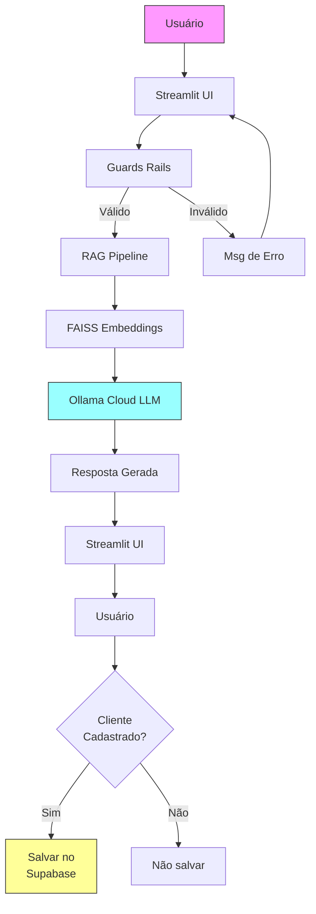

# Chatbot de Oficina Automotiva

Chatbot de atendimento para oficina automotiva utilizando RAG (Retrieval Augmented Generation) com LangChain, Ollama Cloud e Streamlit.

## Tecnologias

- **LangChain** - Framework para aplicações com LLMs
- **FAISS** - Vectorstore para busca semântica
- **Sentence Transformers** - Embeddings locais
- **Ollama Cloud** - Modelo de linguagem via API
- **Supabase** - Banco de dados PostgreSQL na nuvem
- **Streamlit** - Interface web

## Pré-requisitos

- Python 3.11+
- Poetry (gerenciador de dependências)
- Conta no [Ollama.com](https://ollama.com) com API Key
- Conta no [Supabase.com](https://supabase.com) com projeto criado

## Instalação

```bash
# Instalar dependências
poetry install
```

## Configuração

### 1. Variáveis de Ambiente

Configure o arquivo `.env`:

```env
# Ollama Cloud
OLLAMA_API_KEY=sua_api_key_aqui
OLLAMA_MODEL=gemma3:4b
EMBEDDINGS_MODEL=sentence-transformers/all-MiniLM-L6-v2

# Supabase (Banco de Dados)
SUPABASE_URL=sua_url_supabase
SUPABASE_KEY=sua_chave_anon
```

### 2. Configurar Ollama Cloud

- Obtenha sua API Key em: https://ollama.com

### 3. Configurar Supabase (Banco de Dados)

Acesse o [Supabase Dashboard](https://supabase.com/dashboard), selecione seu projeto e:

1. Vá ao **SQL Editor**
2. Execute o seguinte SQL para criar as tabelas:

```sql
-- Tabela de clientes
CREATE TABLE IF NOT EXISTS clientes (
    id SERIAL PRIMARY KEY,
    nome TEXT,
    telefone TEXT UNIQUE,
    email TEXT,
    placa TEXT,
    modelo TEXT,
    ano INTEGER,
    created_at TIMESTAMP DEFAULT NOW()
);

-- Tabela de conversas
CREATE TABLE IF NOT EXISTS conversas (
    id SERIAL PRIMARY KEY,
    cliente_id INTEGER REFERENCES clientes(id) ON DELETE CASCADE,
    mensagem TEXT,
    resposta TEXT,
    created_at TIMESTAMP DEFAULT NOW()
);
```

3. Execute o SQL para configurar políticas de segurança (RLS):

```sql
-- Habilitar RLS
ALTER TABLE clientes ENABLE ROW LEVEL SECURITY;
ALTER TABLE conversas ENABLE ROW LEVEL SECURITY;

-- Políticas para clientes
CREATE POLICY "Allow insert clientes" ON clientes FOR INSERT TO authenticated, anon WITH CHECK (true);
CREATE POLICY "Allow select clientes" ON clientes FOR SELECT TO authenticated, anon USING (true);
CREATE POLICY "Allow update clientes" ON clientes FOR UPDATE TO authenticated, anon USING (true) WITH CHECK (true);

-- Políticas para conversas
CREATE POLICY "Allow insert conversas" ON conversas FOR INSERT TO authenticated, anon WITH CHECK (true);
CREATE POLICY "Allow select conversas" ON conversas FOR SELECT TO authenticated, anon USING (true);
```

4. Obtenha as credenciais em **Settings** → **API**:
   - **Project URL** → `SUPABASE_URL`
   - **anon public** → `SUPABASE_KEY`

## Uso

### Opção 1: Comando Poetry
```bash
poetry run python -m streamlit run app/main.py
```

### Opção 2: Arquivo batch (Windows)
```bash
run.bat
```

Acesse: http://localhost:8501

## Fluxo de Login

O chatbot possui sistema de identificação do cliente:

1. **Sidebar** - Cliente informa seu telefone
2. **Busca** - Sistema verifica se o telefone está cadastrado
3. **Login Automático** - Se telefone existe, acessa imediatamente
4. **Cadastro** - Se telefone não existe, oferece criar conta ou usar sem cadastro

### Opções de Acesso

| Opção | Descrição |
|-------|-----------|
| **Cliente cadastrado** | Informa telefone → Login automático |
| **Novo cliente** | Informa telefone + nome → Cadastro automático |
| **Uso sem conta** | Pode usar o chat anonimamente |

## Estrutura do Projeto

```
chatbot_oficina/
├── app/
│   └── main.py              # Interface Streamlit
├── data/
│   └── documentos/
│       └── FAQ.txt          # Base de conhecimento
├── src/
│   └── chatbot_oficina/
│       ├── chat/
│       │   └── model.py     # Configuração do LLM
│       ├── database/
│       │   ├── client.py    # Cliente Supabase
│       │   └── repository.py # Operações de banco
│       ├── guards/
│       │   ├── topic_validator.py   # Validador de tema
│       │   └── injection_detector.py # Detecção de injection
│       └── rag/
│           ├── loader.py    # Carregamento de documentos
│           ├── vectorstore.py # Índice de embeddings
│           └── chain.py     # Chain RAG
├── .env                     # Variáveis de ambiente
├── run.bat                  # Script para rodar (Windows)
├── pyproject.toml           # Dependências Poetry
└── README.md
```

## Como Funciona

### RAG (Retrieval Augmented Generation)

1. **Ingestão**: Os documentos FAQ são carregados, dividido em chunks e convertidos em vetores de embeddings
2. **Busca**: Quando o usuário faz uma pergunta, o sistema busca os documentos mais relevantes
3. **Geração**: O LLM gera a resposta usando o contexto recuperado

### Guardsrails

- **Validador de Tema**: Bloqueia perguntas fora do tema de oficina automotiva
- **Detector de Injection**: Bloqueia tentativas de prompt injection

### Banco de Dados

- **Clientes**: Salva dados dos clientes (nome, telefone, email, veículo)
- **Conversas**: Registra todas as mensagens do chat (apenas para clientes cadastrados)

## Fluxo de Dados



### Detalhamento do Fluxo

| Passo | Descrição |
|-------|-----------|
| **1. Usuário envia mensagem** | Streamlit captura input do usuário |
| **2. Guards (Validação)** | Topic Validator verifica tema; Injection Detector bloqueia tentativas de injection |
| **3. RAG Pipeline** | FAISS busca documentos similares; Ollama Cloud gera resposta |
| **4. Resposta ao usuário** | Streamlit exibe resposta |
| **5. Persistência** | Se cliente cadastrado, salva no Supabase |
```

## Modelos Disponíveis

O modelo padrão é `gemma3:4b`. Na sua conta Ollama Cloud, os modelos disponíveis incluem:
- `gemma3:4b` (8.6GB)
- `ministral-3:3b` (4.6GB)
- `rnj-1:8b` (16GB)
- E outros...

Para usar outro modelo, altere em `.env`:
```env
OLLAMA_MODEL=nome_do_modelo
```

## Customização

### Adicionar novos documentos

Adicione arquivos `.txt` na pasta `data/documentos/`. O sistema irá processar automaticamente.

## Licença

MIT
